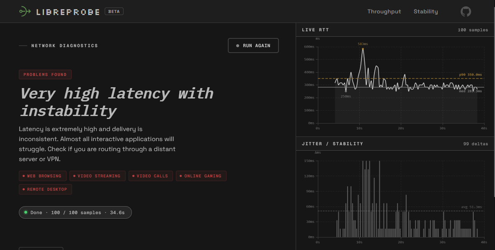
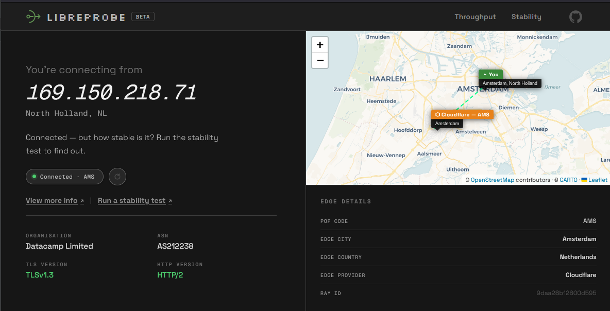
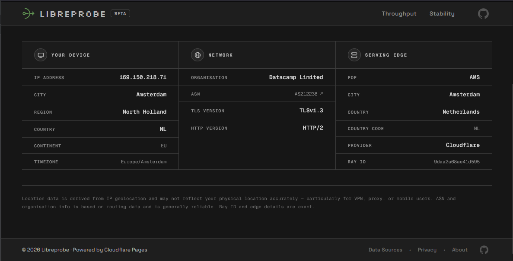
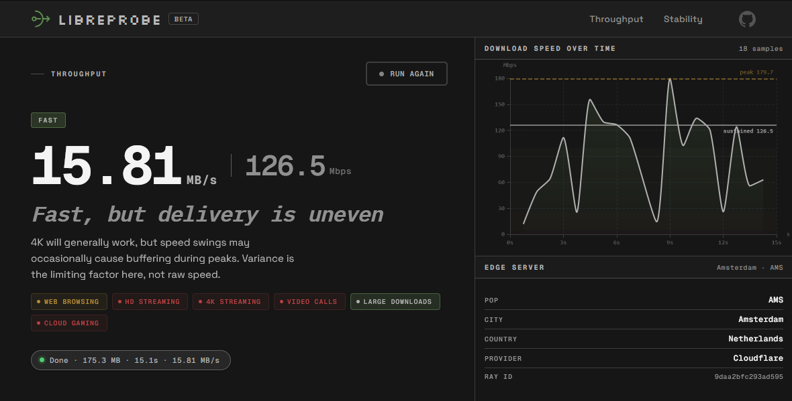

# Libreprobe

Find out why your internet feels bad — even when speed tests look good.

👉 Try it instantly: https://libreprobe.qzz.io



---

## The problem

Speed tests show *bandwidth*. They don't show *delivery quality*. A connection can have 200 Mbps but still cause laggy calls, stuttering games, and buffering streams because of high jitter, latency variance, or inconsistent throughput.

---

## Example

Your ISP promises 200 Mbps. Speed test confirms it. But:
- VoIP calls stutter
- Online games lag randomly
- Streams buffer occasionally

Libreprobe might reveal: good speed, but high jitter. The issue isn't bandwidth — it's delivery stability. That's the problem Libreprobe is designed to expose.

---

## When to use

- Calls lag despite good speed results
- Gaming feels inconsistent or spiky
- Streaming buffers randomly
- Downloads stall or fluctuate
- Debugging network or application performance

---

## What it measures

### Visibility
IP, geolocation, ISP, ASN, TLS/HTTP versions, and edge PoP — from Cloudflare headers, no third-party APIs.

### Throughput
Sustained download capacity via parallel streams. Reports median post-ramp speed, p95 peak, variance, ramp time, and transfer stats.

### Stability
100 RTT probes at 100ms intervals. Measures median latency, jitter, p90 latency, and cold vs. warm handshake overhead. Live RTT and jitter charts with interpretation.

---

## Architecture

Browser → CF Edge Function → CF Edge Streams → Browser metrics pipeline

---

## Who this is for

- Developers debugging performance
- Network engineers investigating instability
- Advanced users diagnosing ISP behaviour

---

## Self-hosting

Requires:

- Cloudflare account
- Wrangler CLI
- One KV namespace binding

Quick deploy:

```bash
git clone https://github.com/grayguava/libreprobe.git
cd libreprobe

wrangler kv namespace create LIBREPROBE_THROUGHPUT_RL
# add binding to wrangler.toml

wrangler pages deploy .
```

---

## Screenshots

Libreprobe provides four diagnostic views:






---

## Methodology (short)

- Fixed-interval RTT avoids burst bias
- Multi-stream tests expose congestion collapse
- Percentile analysis beats averages

For full details, metric definitions, and caveats see:

[`docs/methodology/`](./docs/methodology/)

---

## Versions

- **Full** : production UI identical to hosted version
- **Skinless** : logic-only bundle for embedding, testing, or custom frontends

Both bundles deploy the same way. See the deployment docs for details.

---

## Stack (full version)

Backend runs on Cloudflare Pages Functions (Worker runtime, V8 isolates). No servers or origin compute required.

- Connection data — Cloudflare request headers (`CF-Ray`, `CF-IPCountry`, etc.)  
- Map — OpenStreetMap via CARTO, rendered with Leaflet  
- Charts — Apache ECharts  
- Frontend — Vanilla JS (ES modules), no framework, no build step

---
## Project structure

High-level layout:

```
libreprobe/
├── index.html                             # Home — visibility overview + map
├── info.html                              # Full connection info
├── throughput.html                        # Throughput test
├── stability.html                         # Stability test
├── screenshots/                           # README screenshots
│
├── assets/
│   ├── data/
│   │   └── cloudflare-edge-locations.json # IATA PoP → city + coordinates
│   │
│   ├── graphics/
│   │   ├── icon.svg
│   │   └── Logo.png
│   │
│   ├── js/
│   │   ├── apps/
│   │   │   ├── connectionInfoRenderer.js  # Renders connection data + Leaflet map
│   │   │   ├── getThroughput.js           # Throughput test UI and orchestration
│   │   │   └── getStability.js            # Stability test UI and orchestration
│   │   │
│   │   └── measurement/
│   │       ├── environment/
│   │       │   └── getConnectionInfo.js   # Fetches and parses edge headers
│   │       ├── rtt/
│   │       │   ├── handshake.js           # Cold and warm handshake measurement
│   │       │   ├── probe.js               # Single RTT probe
│   │       │   └── stability.js           # 100-probe RTT measurement loop
│   │       ├── shared/
│   │       │   ├── interpret.js           # Stability result interpretation
│   │       │   ├── interpretThroughput.js # Throughput result interpretation
│   │       │   └── sampler.js             # Shared sampling utilities
│   │       └── throughput/
│   │           └── measureDownlink.js     # Parallel stream download measurement
│   │
│   └── vendor/
│       ├── leaflet/                       # Leaflet.js + CSS
│       └── echarts/                       # ECharts (minified)
│
└── functions/
    └── api/
        ├── info/index.js                  # Connection info endpoint
        ├── ping/index.js                  # Latency probe endpoint
        └── stream/                        # Throughput stream endpoint
            ├── index.js
            ├── globals.js
            ├── shared.js
            └── [token].js
```

---

## Deployment

Libreprobe is a fully static site with Cloudflare Workers functions.  
No frontend build step required.

The `functions/api/` directory is deployed automatically by Cloudflare Pages as Workers.

For full deployment instructions and self-hosting notes see:

[`docs/deployment/`](./docs/deployment/)

---
## Privacy

Libreprobe is stateless.

- No accounts  
- No analytics  
- No tracking  
- No stored results  
- No storage at edge
- No KV persistence except tokens

Connection metadata is processed in memory to generate responses and discarded immediately.

Full policy: https://libreprobe.qzz.io/privacy/

---

## Feedback

Open an issue if you tried Libreprobe and tell us:

- What confused you
- What broke
- What felt unclear
- Whether you used the hosted or self-hosted version

Be blunt. We want honest feedback.
